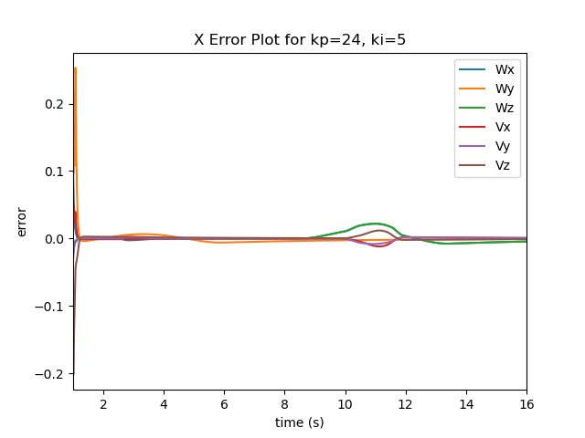
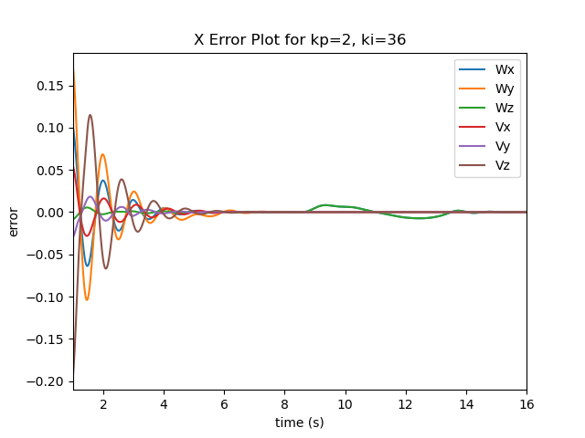
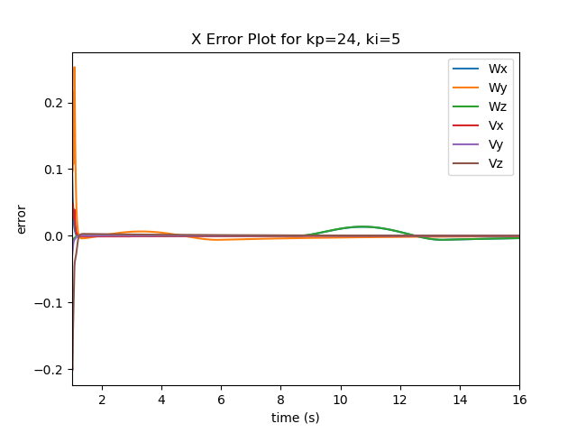

# Mobile-Manipulation

## Overview:

This is my implementation of the [Mobile Manipulation Capstone Project](http://hades.mech.northwestern.edu/index.php/Mobile_Manipulation_Capstone).
The project is a simulation of Kuka YouBot in CoopeliaSim. The code plans a end-effector trajectory, performs odometry as the chassis moves, and performs feedback control to drive the youBot to pick up a block at a specified location, carry it to a desired location, and put it down.

# Code Structure:
The complete code is structured as follows:
- three helper functions are written in seperate files with their tests in their respecttive main() function.
    - NextState.py - contains helper function NextState() that computes next configuration of the robot
    - TrajectoryGenerator.py - contains helper function TrajectoryGenerator() that generates trajectory of the end-effector
    - FeedbackControl.py - contains helper function FeedbackControl() that computes kinematics and feedback FeedbackControl
- The main.py file uses above helper functions to generate a CoppeliaSim.csv and error.csv for any valid start and goal position of cube

- Please run python3 main.py to generate the csv files and plots
- The variables can be altered in the main() function
- A seperate README for respective results in available in results folder

# Algo:
- Robot's initial configuration is defined wrt world frame
- Cube's initial and final position is defined wrt world frame
- TrajectoryGenerator() generates a end-effector trajectory configurations
- FeedbackControl() uses this configurations and determines the twise required and also implements PI feedback FeedbackControl
- NextState takes the current configuration and required twist to update the configuration
- All configuratins are saved in csv format to visualize in CoppeliaSim.
- Additionally x_error is also tracked over the time and plotted subsequently.

# Results with different PI gains:
1.  Initial:
    kp: 24 | ki: 5

    

2.  Overshoot:
    kp:2 | Ki: 36

    

3.  Best Results:
    Kp: 24 | Ki: 5

    